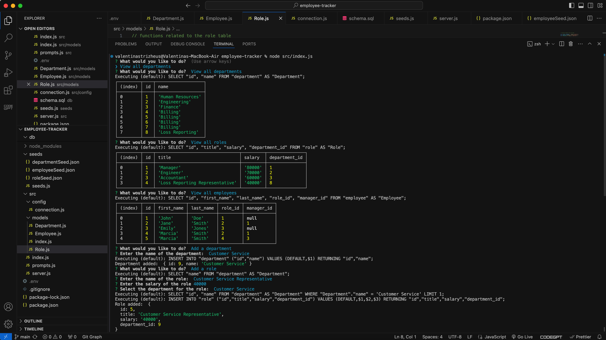

# Employee Tracker

## Description

The Employee Tracker is a command-line application that allows you to manage a company's employee database. It provides functionalities to view and manage departments, roles, and employees. The application is built using Node.js, Inquirer, and PostgreSQL.

## Table of Contents

- [Installation](#installation)
- [Usage](#usage)
- [Features](#features)
- [Contributing](#contributing)
- [License](#license)

## Installation

1. Clone the repository to your local machine:
    ```bash
    git clone https://github.com/your-username/employee-tracker.git
    ```

2. Navigate to the project directory:
    ```bash
    cd employee-tracker
    ```

3. Install the required dependencies:
    ```bash
    npm install
    ```

4. Set up your PostgreSQL database:
    - Create a PostgreSQL database named `employee_tracker_db`.
    - Run the schema file to create the necessary tables:
        ```bash
        psql -U postgres -f db/schema.sql
        ```

5. Seed the database with initial data (optional):
    ```bash
    node seeds/seeds.js
    ```

6. Create a `.env` file in the root directory and add your database credentials:
    ```env
    DB_NAME=employee_tracker_db
    DB_USER='your_user'
    DB_PASSWORD='your_password'
    DB_HOST=localhost
    DB_PORT=5432
    ```

## Usage

To start the application, run:
```bash
node src/index.js
```
Follow the prompts to view and manage departments, roles, and employees.

## Features

- View all departments, roles, and employees.
- Add a new department, role, or employee.
- Update an employee's role.
- Manage the employee database through a simple command-line interface.

## Screenshots



[Video Walkthrough](https://www.loom.com/share/1454c6f3f1ee48f9bae9eb47ef09758a?sid=b838a5b9-7509-4f4b-ba55-0e63d52021ad)

## Repository

For more details, visit the [GitHub repository](https://github.com/valyastriz/employee-tracker.git).
